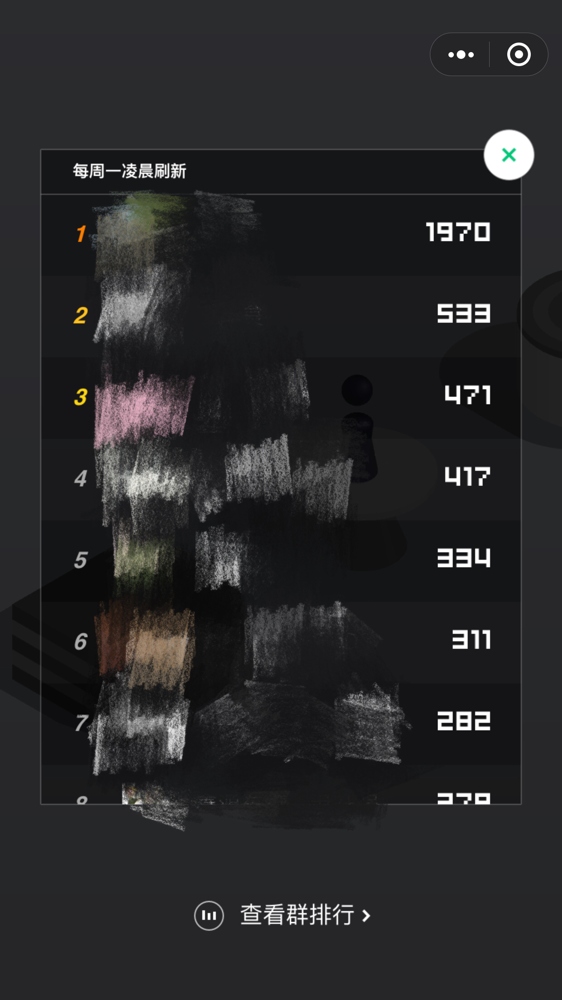

# NodeJS开挂玩微信跳一跳 不要太厉害了
## 前言:
本脚本参照python版本去开发,内置了 ADB 环境,使用者无需安装 ADB 和配置全局变量等


## 使用教程
1. 安装 [NodeJS](https://www.baidu.com/link?url=9bGToaOCDpACM8CqFEVH1cMRBq8Z6nENrAVGOoPqlt3&wd=&eqid=a54c5cf80000d215000000065a4f1bfc)

2. 将本项目克隆到本地

```
git clone https://github.com/JesseWeb/JumpIt.git
```

3. 进入项目根目录JumpIt Shift+右键 选择在此处打开命令窗口

```
 npm install
```
等待包安装完毕后,把安卓手机连上电脑,打开调试模式,开发者选项中有模拟触摸选项的请一并开启

4. 进入微信打开微信跳一跳，点击开始游戏

5.命令行输入

```
    npm run start
```



思路和原理参考 https://github.com/wangshub/wechat_jump_game  [自动跳跃算法细节参考](https://github.com/faceair/wechat_jump_game/blob/master/wechat_jump.py#L50)

## 原理说明
1. 用 ADB 获取手机跳一跳的截图 再用 ADB 把截图拉出来
2. 利用nodejs分析把图片解析为像素分析
3. 计算出棋子、棋盘的位置后，算出距离再乘以一个换算成时间的系数，最后转化为按压的时间
4. 再用 ADB 工具实现点击屏幕 

## 移植参照:
[神奇的战士-王松](https://github.com/wangshub)

友情链接:
[教你用 Python 来玩微信跳一跳](https://github.com/wangshub/wechat_jump_game)
## 使用须知:
由于本人手上没有mac设备(ios调试需要mac设备的支持),遂只开发了安卓端的脚本,


## 声明:
本脚本仅供个人测试和代码分享,请勿做商业用途以及恶意刷榜工具,仅供参考